# 轻松上手markdown（非CS专业友好版）
markdown是一种轻量级标记语言，它允许人们使用易读易写的纯文本格式编写文档，然后转为网页或pdf进行阅读。在很多时候，我们的报告都是通过markdown完成的。闲言少叙，我们直接开始！

## 目录
```
环境搭建
    编辑器安装
    插件安装
创建文件
基本语法
    标题
    段落
    文本
    列表
    表格
    图片
    链接
    代码块
```

## 环境搭建

### 编辑器安装
在这里我们选择使用**Visual Studio Code**作为我们的编辑器。它的编辑界面是这样的：
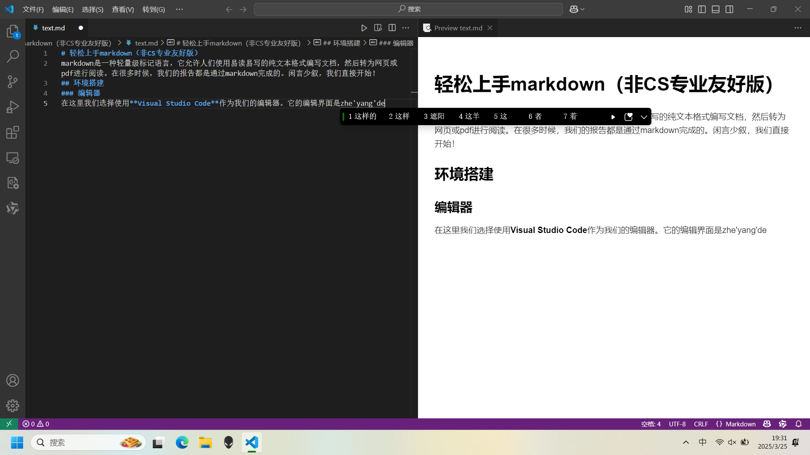
~~此处禁止套娃~~

首先要访问[Visual Studio Code](https://code.visualstudio.com/)官网下载安装。
点击**Download** 按钮，选择适合自己系统的版本点击安装，计算机将下载一个VS Code下载器。
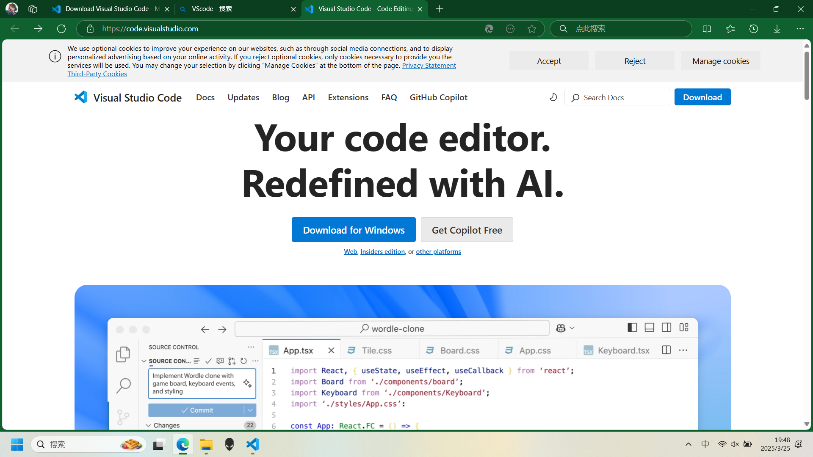
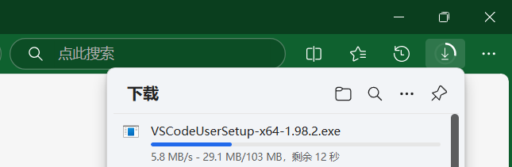

下载器就绪后直接双击打开，同意协议后点击下一步。
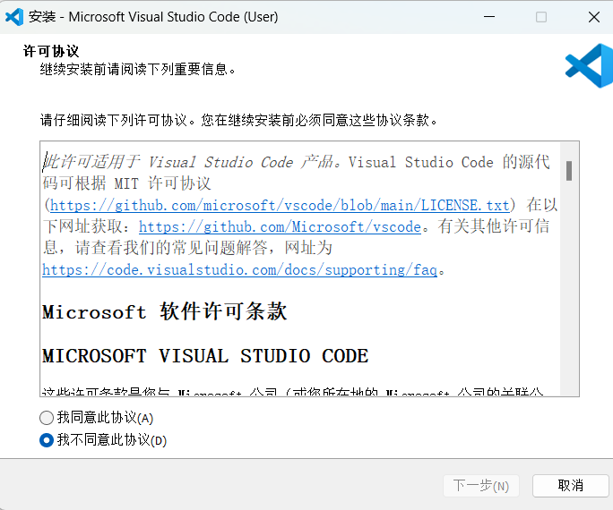

这里是一些安装选项，建议勾选**创建桌面快捷方式**，然后点击**下一步**->**安装**。
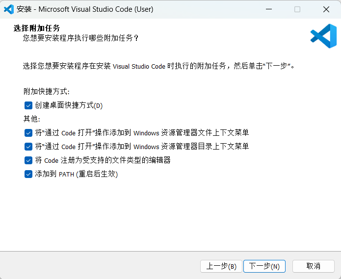

**注意**：如果安装时勾选了“将“通过Code打开”操作……”的选项，安装后右键点击文件弹出的旁栏就会显示“通过Code打开”的选项，不希望自己旁栏太过复杂的同学可以取消勾选这两项。
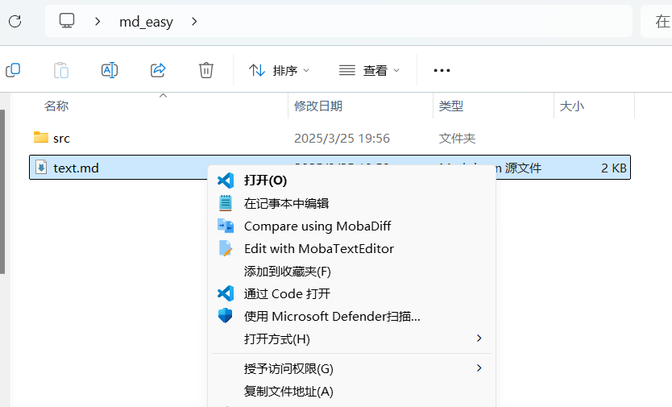

### 插件安装
目前在VS Code中下载量最高的markdown插件是 **Markdown All in One** ，安装后，我们可以在编辑器中看到一些预览效果。

首先，点击VS Code编辑区左栏四个小方块的图标，在弹出的搜索栏中搜索**Markdown All in One**，点击安装即可。如下图所示：
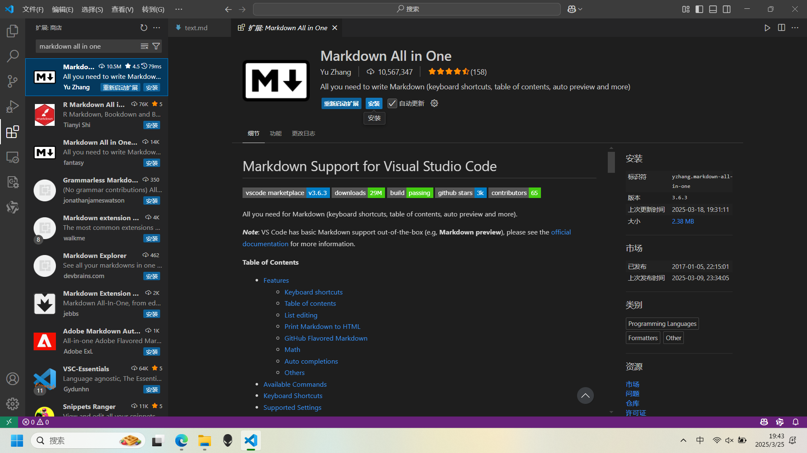

## 创建文件
markdown文件的后缀名是`.md`，打开VS Code，点击左上角的**文件**按钮，在弹出的菜单中选择**新建文件**（例如`test.md`）。如下图所示，在弹出的输入框中输入文件名，点击**确定**。
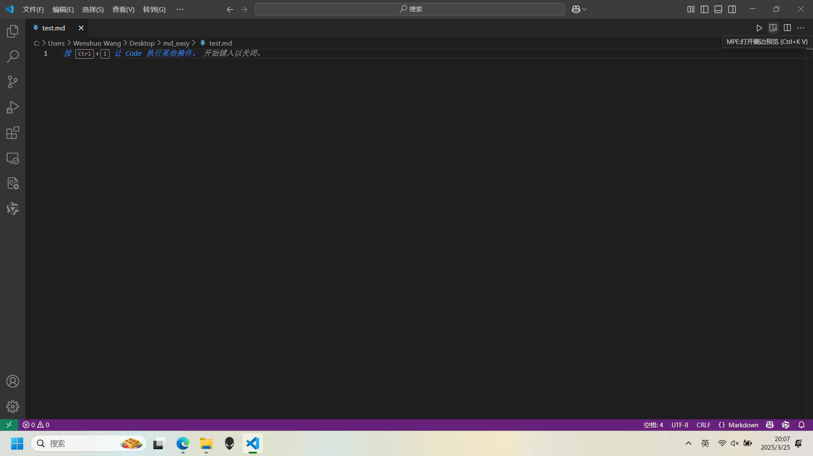

如上图所示，点击图中鼠标指示的位置可以打开预览，在这里可以实时看到你写的内容。
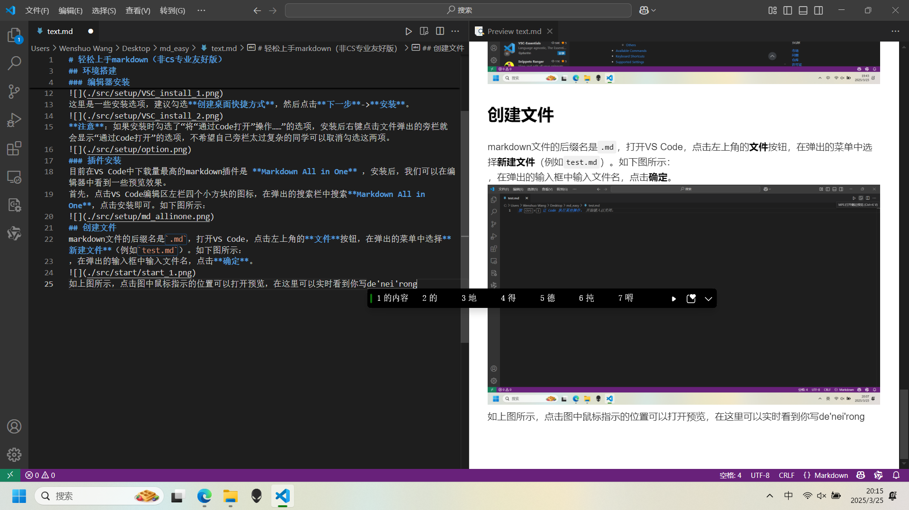
~~此处禁止套娃~~

## 基本语法

### 标题
标题的格式是`# + 空格 + 标题内容`,例如：
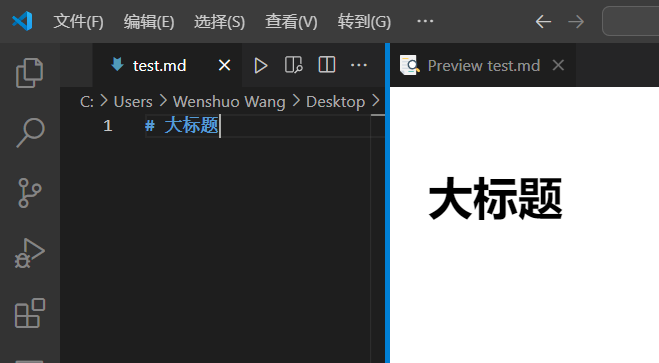

markdown最多支持6级标题，如图所示，`#`越多，标题越小。

`#`超过6个时将会以纯文本形式输出。

### 段落
如果你想要分开段落，只需要多打一个空行，这和我们的直觉一致。下图展示了分段和不分段的效果。
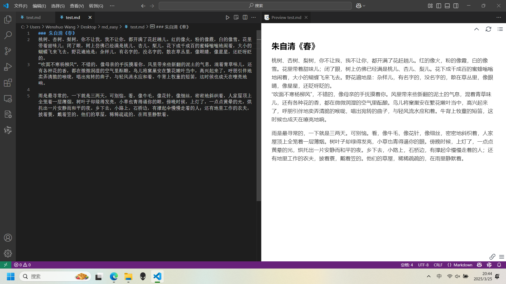

### 文本
markdown支持以下几种文本格式：
- 普通文本：直接敲出即可
- 斜体：使用`_`或`*`将希望倾斜的文本括起来
- 粗体：使用`**`将希望加粗的文本括起来
- 删除线：使用`~~`将希望删除线的文本括起来
- 引用：将`>`加在在文本前面即可
- 代码：使用“`"将`\`将希望显示为代码的单行文本括起来
如下图所示:
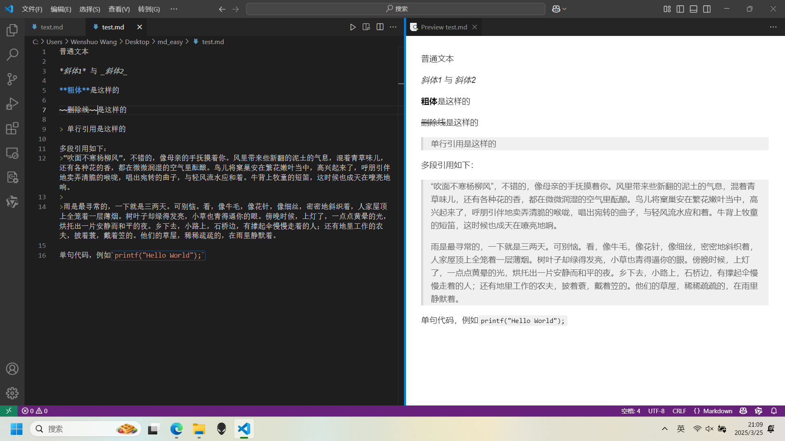

### 列表
markdown支持有序列表和无序列表，有序列表使用数字加`.`，无序列表使用`*`或`-`。
示例如下：
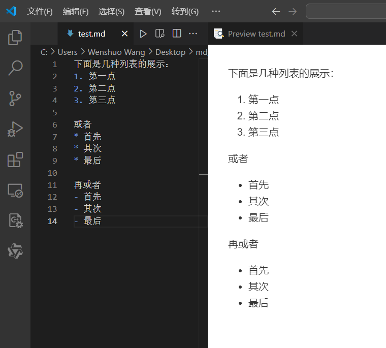

### 表格
markdown支持表格，表格的格式是：
```markdown
| 标题1 | 标题2 | 标题3 |
| --- | --- | --- |
| 内容1 | 内容2 | 内容3 |
| 内容4 | 内容5 | 内容6 |
```
示例如下：
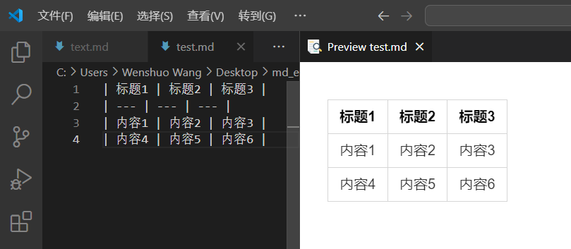

你可以在短横线行中通过添加冒号 : 来指定每一列的对齐方式：
- 左对齐：默认，或在短横线左边添加冒号 `:---`
- 右对齐：在短横线右边添加冒号 `---:`
- 居中对齐：在短横线两边都添加冒号 `:---:`
示例如下：
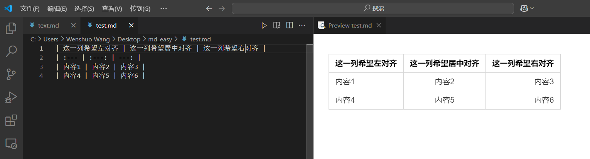

### 图片
markdown支持本地图片和网络图片。
插入图片的基本格式如下，注意前面的感叹号和后面的括号都必须是英文字符。
```markdown

```
对于本地图片，例如：
```markdown
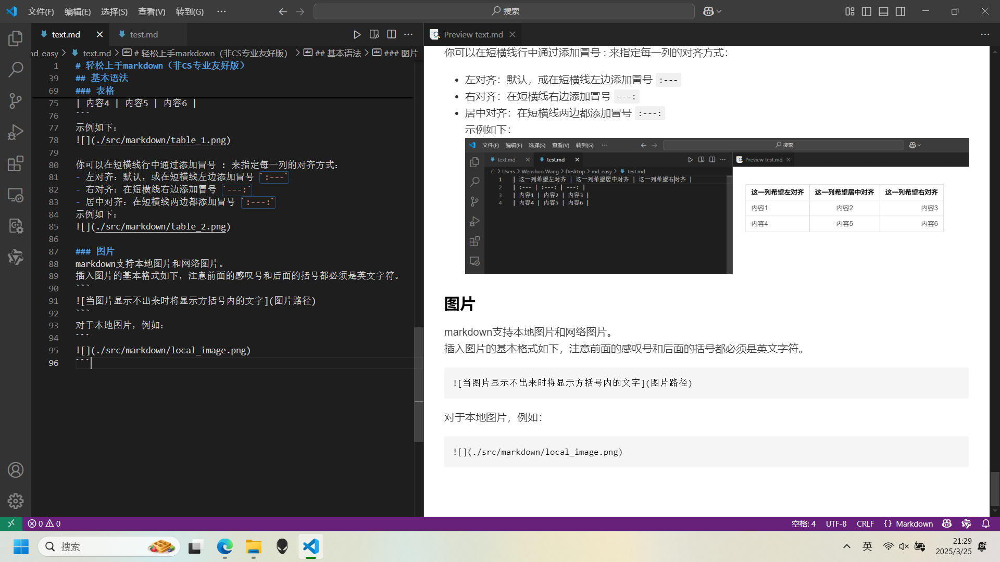
```
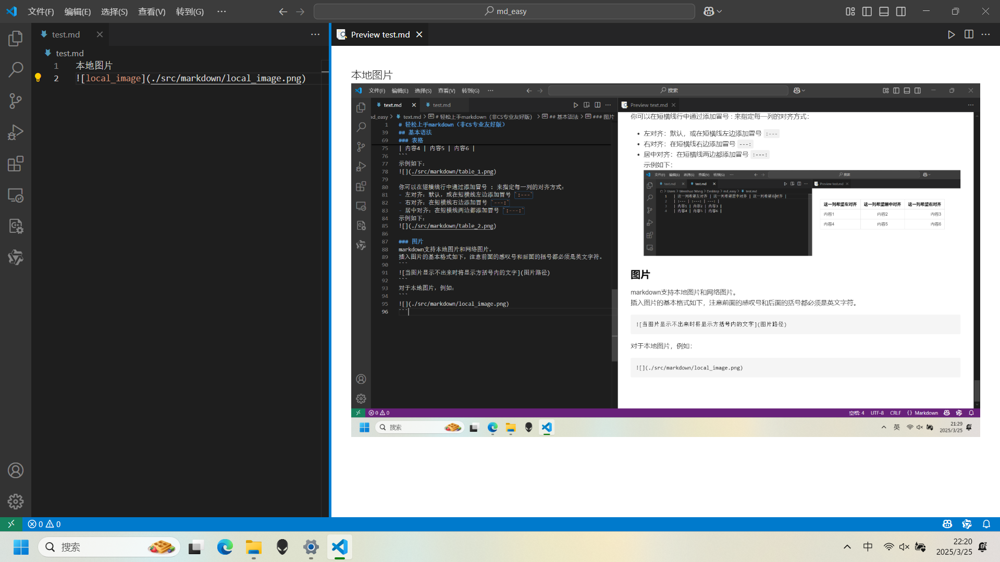

对于网络图片，例如：
```markdown

```
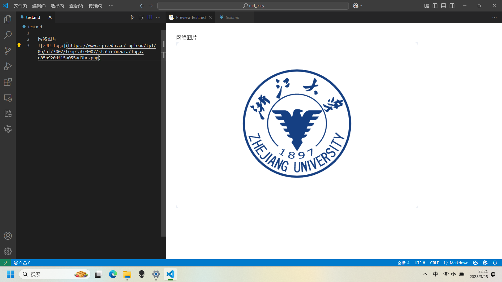

### 链接
markdown支持网络链接，格式为：
```markdown
[链接文字](链接路径)
```
例如：
```markdown
首先要访问[Visual Studio Code](https://code.visualstudio.com/)官网下载安装。
```
效果如图所示
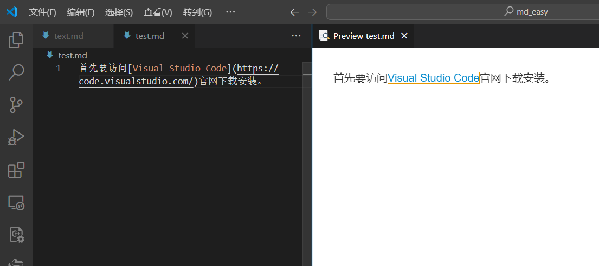
点击蓝色的字后将自动通过浏览器打开链接。

### 代码块
在之前我们已讲过句中单行代码的格式，例如：
```markdown
这是一行代码：`printf("hello world");`
```
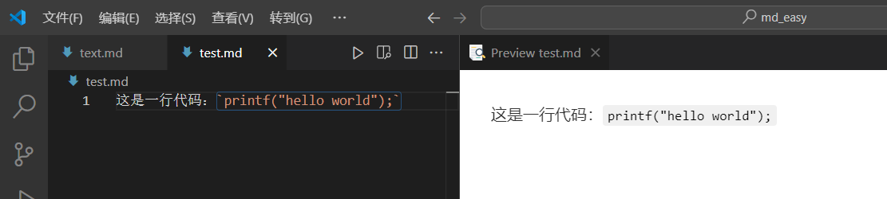

在markdown中同样可以使用代码块，格式为：
````markdown
这是一段代码：
```
    #include <stdio.h>
    int main()
    {
        printf("hello world");
        return 0;
    }
```
或
~~~
    #include <stdio.h>
    int main()
    {
        printf("hello world");
        return 0;
    }
~~~
````
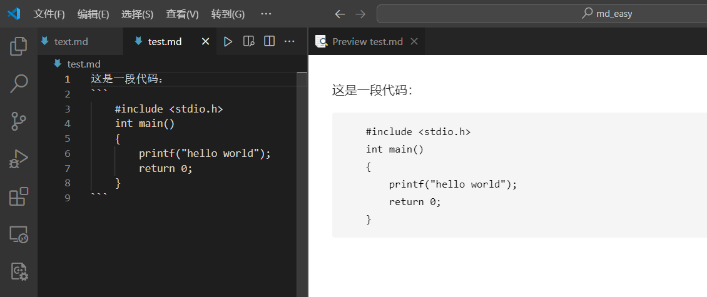

值得一提的是，markdown同样可以在开头的三个```中指定语言，进而实现代码高亮。
例如C语言：
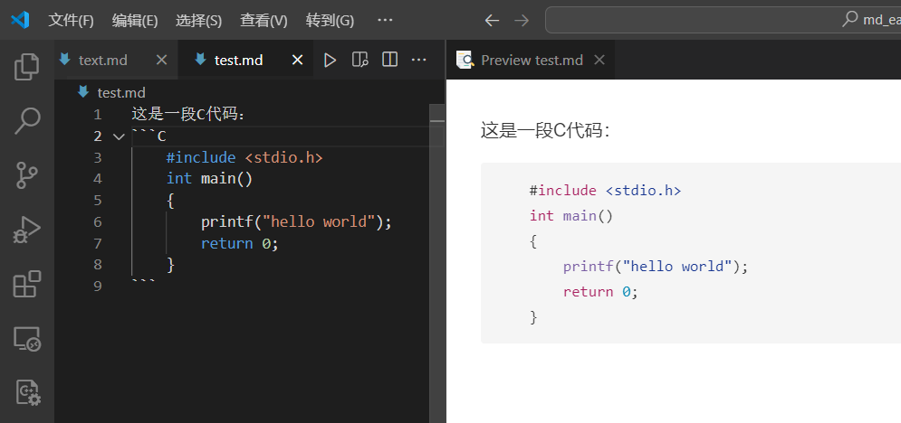

硬件描述语言也可以
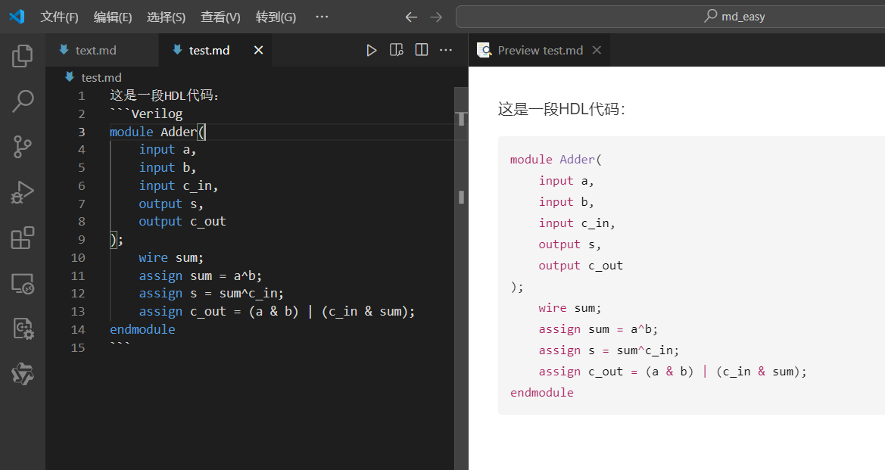

甚至是markdown本身：
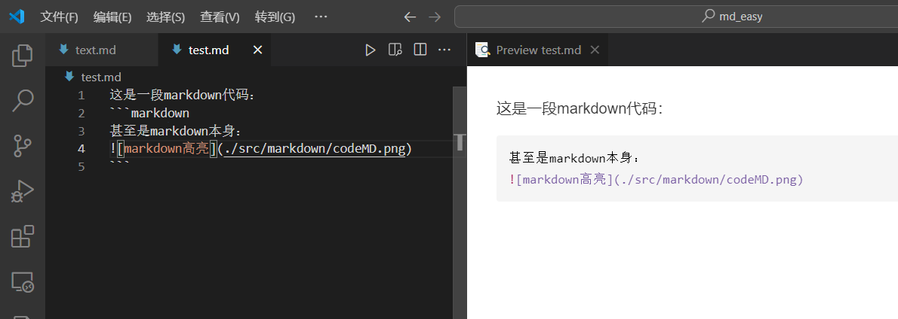

Makefile、Bash.sh等也都可以。

以上就是markdown的基础语法，更多语法可以参考[markdown中文](https://www.markdown.cn/)。

这个教程也是使用markdown完成的，如果你希望下载这个文档，可以点击[这里](https://github.com/Eitr-SphinSaure/markdown_easy)。
~~作者酷爱套娃~~